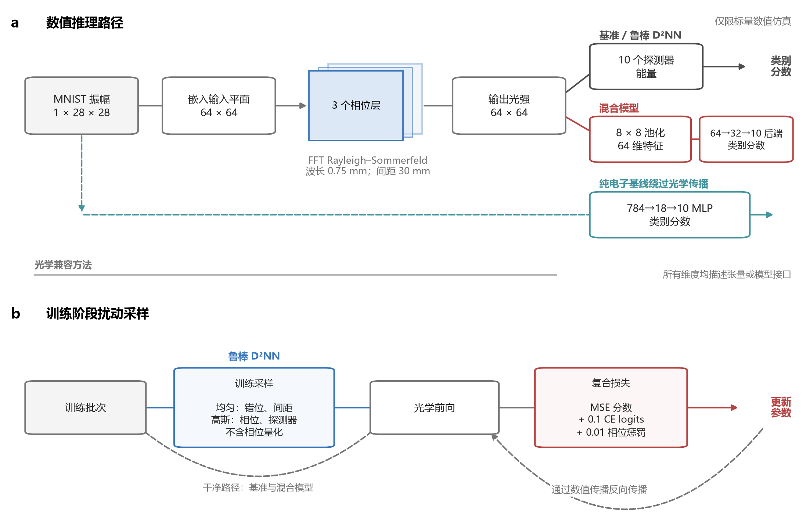
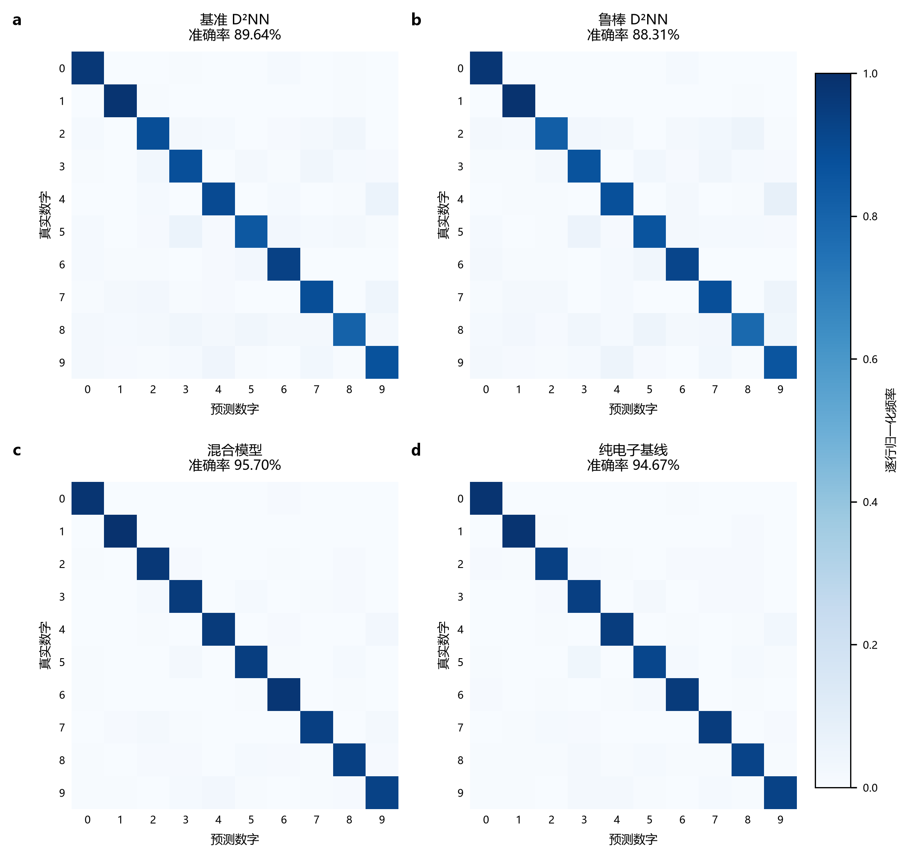
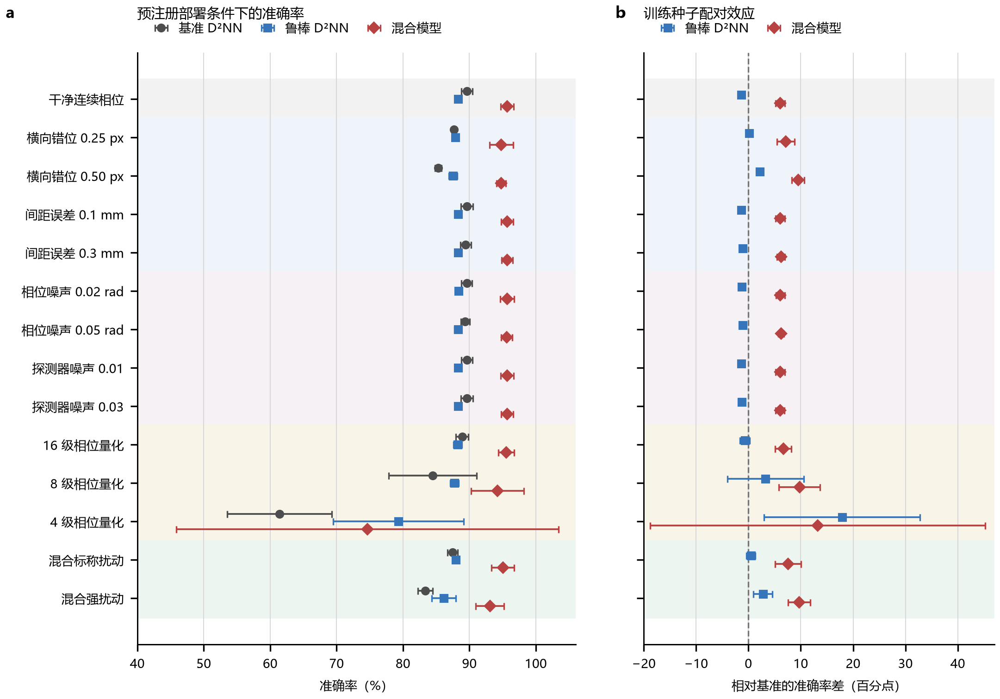
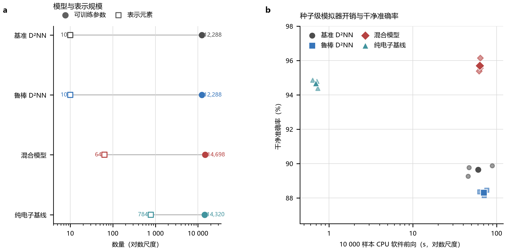

# 衍射深度神经网络鲁棒性与混合光电推理的协议约束数值评估：基于 MNIST 与 Fashion-MNIST 的研究

# 摘要

衍射深度神经网络以可训练无源相位层调制光场完成分类，但在部署中会受到层间错位、传播距离误差、相位噪声、探测器噪声和相位量化等扰动。现有鲁棒训练方法与混合光电架构各自使用不同的训练设置、评估条件和统计口径，结果之间难以比较，数值仿真结论与硬件性能主张之间的证据边界也常被混淆。本文提出协议约束的光电比较框架，固定数据划分、训练种子、部署条件、评价指标与主张边界，在 MNIST 与 Fashion-MNIST 上对基准 D²NN、鲁棒 D²NN、混合光电模型与纯电子基线进行系统比较。三类光学兼容方法共享一个包含 14 个条件和 34 次部署采样的冻结评估方案，全部在完整测试集上运行，跨方法差异按训练种子配对。

主要结果表明四点。第一，扰动感知训练的收益是条件选择性的：在三个种子的原始队列中，它以 1.33 个百分点的干净准确率代价，在 0.50 像素横向错位、混合强扰动和四级相位量化下分别获得 2.20、2.76 和 17.91 个百分点的收益，但在传播距离误差、相位噪声和探测器噪声下低于基准。在 Fashion-MNIST 上，该方法的干净代价方向一致，而所有扰动条件下的收益区间均跨越 0，包括四级量化下的 +21.67 个百分点（95% CI：-5.76 至 +49.10），因此第二个数据集只复现了混合模型的条件排序模式，未复现扰动感知训练的确定收益。第二，混合光电读出在 MNIST 与 Fashion-MNIST 上均在 14 个冻结条件中的 13 个条件下取得最高平均准确率，唯一例外是四级相位量化；把四级相位量化纳入训练后，该条件的平均准确率由 67.69% 升至 94.10%（配对增益 26.41 个百分点，95% CI：9.26 至 43.56），说明该失效主要来自训练过程而非混合架构本身；区分前向路径后可见，该模型的收益出现在四级掩模路径上，而它在未量化路径上仅为 61.74%。第三，消融表明混合模型的收益来自可学习读出本身：以单层线性映射替换电子感知机后干净准确率与混合模型持平（配对差 +0.91 个百分点，95% CI：-0.21 至 2.02），把池化分辨率由 8×8 降到 4×4 的配对差同样跨越 0。第四，加入 34 622 参数的 LeNet-5 电子基线后其干净准确率达 98.25%，高于混合模型的 95.68%，说明"混合模型与纯电子基线表现相近"的表述依赖于电子基线的强度。

本文的全部数值结论均来自完全相干标量传播仿真，不包含实体光学平台或真实边缘设备测量。参数量、中间表示维度与 CPU 软件仿真计时只描述模型结构与数值模拟开销，不代表物理光学传播时延、设备时延、功耗或能效。研究结果构成一个条件选择性与光电读出分割的可复现数值基准。

**关键词：** 衍射深度神经网络；混合光电推理；鲁棒性评估；部署扰动；边缘推理；协议约束数值仿真
# 1 引言

边缘推理系统需要在本地计算资源受限和部署条件不可控的双重约束下维持分类性能。与数据中心推理不同，边缘设备无法依赖稳定的机架环境和精密光学对准，温度漂移、机械振动和制造公差都会导致实际部署条件偏离设计标称值。光子计算架构提供了一条有吸引力的路径：将部分线性运算从电子处理器转移到光传播过程本身，通过无源相位层在物理空间中完成矩阵乘法，从而缓解边缘设备的存储和计算压力 \cite{Sludds2022NetcastEdge,Zhou2021ReconfigurableDPU}。然而，名义准确率不足以说明系统的实际适用性。一个在干净仿真条件下达到 89.64% 准确率的衍射网络，在 0.50 像素的层间错位下降至 85.33%，在四级相位量化下进一步降至 61.41%。完整的评估必须回答三个问题：模型能够容忍哪些扰动、哪种信息表示跨越光电计算边界、以及哪些性能结论来自数值仿真而非物理硬件。

在上述背景下，本文聚焦于一个核心问题：**在统一协议约束下，扰动感知训练和混合光电推理各自的鲁棒性收益出现在哪些条件下，又在哪些条件下失效或反转。** 这一问题的回答对边缘部署具有直接的实际意义：如果部署者知道鲁棒训练的收益集中在横向错位和粗量化条件，而无法覆盖传播距离误差和探测器噪声，就可以在设计阶段选择更有针对性的方案，而不是依赖一个笼统的"鲁棒性"标签。同样，如果混合光电模型在多数条件下优于固定探测器读出、但在极端量化下不稳定，那么部署者需要在相位量化精度和电子后端复杂度之间做出有依据的权衡。

衍射深度神经网络的鲁棒性研究已形成多条技术路线。Mengu 等人在训练阶段采样横向和轴向偏移，证明扰动注入可以提高对准容差 \cite{Mengu2020MisalignmentResilient}；Wang 和 Zhou 通过相位滤波和并行子网络结构增强了错位容忍度 \cite{Wang2025PhaseFilteredD2NN,Wang2026ParallelSubnetworkD2NN}；Zhu 等人提出异质衍射神经元尺寸，在不依赖扰动注入的条件下提供结构性鲁棒 \cite{Zhu2026HybridRobustODNN}；Hoshi 等人针对体全息衍射元件难以预先建模的波前像差，提出在训练阶段使模型适应未知像差的方法 \cite{Hoshi2025WavefrontAberrationTolerant}；Xu 等人将 sharpness-aware training 引入物理神经网络，从损失景观锐度的角度优化部署稳定性 \cite{Xu2026SharpnessAwarePNN}。在读出端，Mengu 等人分析了 D²NN 与电子网络的联合优化，证明学习型电子后端可以替代固定探测器判决 \cite{Mengu2020DiffractiveIntegration}；Chang 等人则用优化衍射光学元件承担光电卷积分类器的首层计算 \cite{Chang2018HybridOpticalElectronicCNN}。这些工作分别验证了鲁棒训练和混合架构的有效性，但存在一个共同的不足：每项研究使用自己的训练设置、评估条件和统计方法，结果之间无法直接比较。例如，Mengu 等人的错位鲁棒网络在特定错位分布下报告了准确率恢复，但没有说明同一模型在相位量化或探测器噪声下的表现是否同步改善；混合光电模型的研究通常只报告干净条件或单一扰动下的结果，缺乏多扰动联合作用的系统评估。

上述两条技术路线在读出设计上的差异进一步说明了这一不足。为每一类别配置正负探测器对、并将类别分配到并行衍射网络，可以在光强非负约束下改善读出对比度 \cite{Li2019DifferentialDetection}；可重构衍射处理器和软硬件协同多任务网络则把光学前端扩展为可编程、可共享的计算资源 \cite{Li2021RealtimeMultitaskD2NN}；主动调制衍射网络中的随机相位 dropout 通过采样相位掩模提供正则化 \cite{Xiao2021RandomPhaseDropout}。在建模边界方面，端到端可微光学设计框架使架构探索与器件约束可以在同一流程内完成 \cite{Li2023LightRidge}，而逐像素二级量化编码表明极简低比特光学前端同样可行 \cite{Liu2025MinimalistDONN}。相位受限的量化感知训练进一步说明，离散相位等级应在训练阶段建模而非事后施加 \cite{Wang2025PLQAT}；空间相干性研究则指出完全相干照明只是一种特定建模边界 \cite{Filipovich2024SpatialCoherence}，归一化截止频率从空间频率传播角度提供了鲁棒性的可解释判据 \cite{Wang2026NormalizedCutoffRobustness}。这些方法各自有效，但被报告的扰动族、读出结构和统计口径互不相同，因而无法回答本文关注的"收益出现在哪些条件下"这一问题。

这一不足带来的影响是实质性的。部署者面对文献中的多个"鲁棒"方案时，无法判断哪个方案适合特定的部署条件组合；研究者也无法确定一个方法的鲁棒性收益究竟是普遍存在的还是条件选择性的。更深层的问题是，数值仿真与硬件性能主张之间的证据边界长期模糊：部分文献用软件传播程序的运行时间来暗示光学计算的速度优势，或者用参数量来推断边缘设备的能效，这些外推缺乏严格的方法论约束。

本文的目标是弥补上述不足，但不是提出新的鲁棒训练算法或新的光电混合结构。本文的贡献在于建立一种协议约束的光电比较方法：固定数据划分、训练种子、部署条件、评价指标和主张边界，在完全相同的条件下系统比较基准 D²NN、扰动感知训练的鲁棒 D²NN、混合光电模型和纯电子基线。具体而言，三类光学兼容方法共享一个冻结的 14 条件、34 次部署采样评估方案，部署采样先在训练种子内部聚合，再按种子进行跨方法配对，所有汇总结果关联 checkpoint 和产物哈希。通过这一方法，本文旨在回答三个具体问题：扰动感知训练的收益在哪些扰动族下成立、在哪些条件下反转；64 维池化光学表示加电子分类头相比十探测器读出在多类扰动下的实际增益有多大；以及哪些结论可以安全地从当前数值仿真中外推，哪些必须等待物理硬件验证。

# 2 实验方法

## 2.1 统一任务与模型队列

本文将 MNIST 分类建模为十分类任务，使用公开的 torchvision MNIST 数据集。数据集包含 60 000 幅训练图像和 10 000 幅测试图像。每个训练种子确定性地生成 55 000/5 000 的训练集与验证集划分，并记录索引 SHA-256。完整测试集只在冻结训练流程结束后使用，不参与任何模型选择或超参数调整。

正式队列包含四类方法，每类使用训练种子 42、43 和 44，共形成 12 个独立训练模型：

1. **基准 D²NN**：采用干净条件训练，输出端使用十个固定探测器区域读出。该模型代表 D²NN 的标准配置，作为所有比较的参照基线。
2. **鲁棒 D²NN**：与基准 D²NN 共享相同的光学结构和读出方式，但在训练阶段采样部署扰动（详见 2.3 节）。该模型代表扰动感知训练策略。
3. **混合光电模型**：使用与基准 D²NN 完全相同的光学前端（三个可训练相位层），但输出端将光强进行自适应 $8\times8$ 平均池化，形成 64 维表示，再输入 64-32-10 的电子 MLP 进行分类。该模型代表光电混合读出策略。
4. **纯电子基线**：采用 784-18-10 的多层感知机，直接将 $28\times28$ 图像展平为 784 维输入，不含光学传播。该模型仅进入干净条件评估，用于提供电子计算的参考性能。

混合模型和纯电子基线的参数量分别为 14 698 和 14 320，处于相近尺度，但输入表示边界不同：混合模型接收光学池化特征（64 维），纯电子基线接收原始像素（784 维）。

图 1 对比四类方法的数值推理路径与扰动感知训练流程。图 1a 在同一面板内并列三条路径：基准 D²NN 与鲁棒 D²NN 的探测器区域能量读出、混合模型的池化光学特征加电子分类头，以及绕过光学传播的纯电子基线。图 1b 给出鲁棒 D²NN 在训练阶段的扰动采样流程。该图为读者建立四类方法在光电计算分割边界上的直观差异。

**图 1 | 数值推理路径与扰动感知训练。** **a，** 数值推理路径。基准 D²NN 与鲁棒 D²NN 使用探测器区域能量读出；混合模型将 8×8 池化光强输入电子分类头；纯电子基线绕过光学传播直接处理图像向量。**b，** 训练阶段扰动采样。鲁棒 D²NN 在训练时采样横向错位、传播距离误差、相位噪声和相对探测器噪声；相位量化只用于部署评估，不进入鲁棒训练。全部路径均为标量数值仿真。

## 2.2 标量衍射传播模型

光学前端将输入图像嵌入 $64\times64$ 振幅平面，并使用三个可训练相位层。本文采用与 Lin 等人 2018 年 D²NN 一致的数值尺度 \cite{Lin2018AllOpticalD2NN}：波长 0.75 mm，像素间距 0.4 mm，层间传播距离 30 mm。该尺度仅用于数值仿真，不对应本文制造或标定的实体器件。

第 $l$ 层的实际相位先对可训练相位执行量化，再叠加相位噪声：

$$
\widetilde{\phi}_l = Q(\phi_l) + \epsilon_l, \qquad
T_l = \exp(i\widetilde{\phi}_l).
$$

其中 $Q(\cdot)$ 表示将相位等分为 $L$ 级的量化算子，$\epsilon_l$ 为相位噪声。传播过程使用 Rayleigh-Sommerfeld 脉冲响应的 FFT 实现。对于传播距离 $d$，离散核写为

$$
h_d(\Delta x,\Delta y) =
-i\frac{\Delta^2}{\lambda}\frac{d}{r^2}\exp(ikr),
\qquad
r=\sqrt{\Delta x^2+\Delta y^2+d^2},
\qquad
k=\frac{2\pi}{\lambda}.
$$

每次传播执行带填充的线性卷积，并将中心区域裁剪回 $64\times64$。层间距离误差直接改变相应传播算子的距离参数。

## 2.3 部署扰动模型与扰动感知训练

每次部署采样为各衍射层独立生成扰动。扰动类型及其分布如下：

表 1 | 部署扰动类型与分布参数

| 扰动类型 | 分布 | 参数 |
|---|---|---|
| 水平/垂直位移 | 对称均匀分布 | 以像素为单位 |
| 传播距离误差 | 对称均匀分布 | 以米为单位 |
| 相位噪声 | 高斯分布 | 以弧度为单位 |
| 相对探测器噪声 | 按特征均值缩放 | 标准差固定 |
| 相位量化 | 确定性等分 | $[0,2\pi)$ 分为 $L$ 级 |

鲁棒 D²NN 在训练阶段联合采样最大 0.5 像素横向错位、最大 $10^{-4}$ m 层间距离误差、标准差 0.05 rad 的相位噪声和标准差 0.01 的相对探测器噪声。相位量化不进入鲁棒训练，因此量化条件下的评估结果反映的是对未显式训练扰动的迁移表现，这是一个有意的设计选择，用于检验扰动注入训练是否能产生超出训练分布之外的鲁棒性。

基准 D²NN 和鲁棒 D²NN 的训练目标为：

$$
\mathcal{L}=\alpha\mathcal{L}_{\mathrm{MSE}}
+\beta\mathcal{L}_{\mathrm{CE}}
+\gamma R_{\mathrm{phase}}.
$$

其中 $\alpha=1$、$\beta=0.1$、$\gamma=0.01$。$\mathcal{L}_{\mathrm{MSE}}$ 比较归一化类别分数与 one-hot 标签，$\mathcal{L}_{\mathrm{CE}}$ 作用于模型 logits，$R_{\mathrm{phase}}$ 为水平和垂直方向环形相位差平方的平均值。混合模型和纯电子基线使用交叉熵训练。

基准 D²NN 和鲁棒 D²NN 使用十个固定探测器掩模完成读出。类别 $c$ 的能量分数为

$$
s_c=\sum M_c I.
$$

随后将能量归一化，并通过对数变换得到交叉熵损失使用的 logits：

$$
z_c=\log\left(\frac{s_c}{\sum_j s_j+\varepsilon}+\varepsilon\right).
$$

混合模型则把输出光强做自适应 $8\times8$ 平均池化，得到 64 维表示后交由电子分类头处理，因此其读出边界与固定探测器掩模不同。

## 2.4 训练协议与模型选择

所有模型训练 3 个 epoch，batch size 为 128，学习率为 0.01，数据加载进程数为 0。训练启用 PyTorch 确定性算法以保证可重复性。checkpoint 按验证集干净准确率、探测对比度和 epoch 顺序选择。基准 D²NN、混合模型和纯电子基线使用干净训练；只有鲁棒 D²NN 在训练阶段采样扰动。

正式运行环境为 Windows 10、Python 3.11.7、PyTorch 2.10.0、torchvision 0.25.0、NumPy 2.4.6、Matplotlib 3.11.1 和 Pillow 12.3.0。所有正式评估均在 CPU 上执行并启用确定性算法。各评估 manifest 记录处理器信息、线程数、代码提交、工作区状态和关键源文件 SHA-256。

三个 epoch 是冻结的比较条件，不是充分训练的证明。各方法的逐 epoch 验证准确率显示，多数方法在第三个 epoch 仍在上升：量化感知训练的混合模型由 51.35% 经 56.54% 升至 60.25%，末期单轮增益达 3.71 个百分点；混合模型的两个消融变体末期增益分别为 0.94 和 1.15 个百分点；Fashion-MNIST 上的三种方法末期增益在 0.59 至 1.41 个百分点之间。鲁棒 D²NN 的末期增益为 0.98 个百分点，而基准 D²NN、纯电子基线和 LeNet-5 已趋平缓。相位滤波 D²NN 是唯一在训练后期退化的方法，其验证准确率由 77.34% 单调降至 73.25%。因此本文全部比较都应理解为"三个 epoch 预算下"的比较，不能据此推断任一架构的能力上界；量化感知训练受该预算影响最大。逐 epoch 曲线保存在 `results/training_curves/`。

正式队列只纳入与冻结协议匹配、具有相邻训练 manifest、能够严格加载且完成全部 10 000 幅测试图像评估的运行。混合模型训练种子 44 的首次运行中断，保留其不完整 checkpoint 作为失败记录，不进入正式比较；完成相同冻结配置的 `retry1` 运行通过严格加载后作为种子 44 的正式模型。正式测试样本、条件和部署采样均未作结果驱动排除。

## 2.5 冻结评估方案

三类光学兼容方法共享同一个冻结评估方案。该方案包含 14 个条件：

表 2 | 冻结评估方案的 14 个条件与采样配置

| 条件类别 | 具体条件 | 采样次数 |
|---|---|---|
| 干净连续相位 | 无扰动 | 1 |
| 横向错位 | 0.25 / 0.50 像素 | 各 3 |
| 传播距离误差 | 两级 | 各 3 |
| 相位噪声 | 两级 | 各 3 |
| 相对探测器噪声 | 两级 | 各 3 |
| 相位量化 | 16 / 8 / 4 级 | 各 1 |
| 混合扰动 | 中 / 强 | 各 3 |

随机条件使用 3 次采样，确定性量化条件使用 1 次采样，总计 34 次部署采样。全部条件均在完整 10 000 幅测试图像上运行。纯电子基线只进入独立的干净条件评估。

## 2.6 统计方法

训练种子定义为独立统计单位，每种方法 $n=3$。同一训练模型下的部署采样先取平均，再进行跨种子汇总。跨方法差异按训练种子、条件和光学采样编号配对。本文报告平均值、标准差、三个种子值以及基于 Student-t 分布的双侧 95% 置信区间，但不执行零假设显著性检验。14 个条件的区间是边际区间，未进行同时覆盖校正。测试样本、部署采样和计时重复均不作为独立重复。

主要指标为准确率和十类别 macro-F1。macro-F1 对所有十个输出类别求平均，零分母类别的 F1 记为 0。次要指标为平均交叉熵和平均探测对比度。逐样本预测能够重建混淆矩阵并复算上述指标。

# 3 结果

## 3.1 干净条件下的性能排序

表 3 | 干净条件下的分类性能（均值 ± 标准差，$n=3$ 个训练种子）

| 方法 | 准确率（%） | macro-F1 |
|---|---|---|
| 基准 D²NN | 89.64 ± 0.33 | 0.8947 |
| 鲁棒 D²NN | 88.31 ± 0.16 | 0.8813 |
| 混合模型 | 95.70 ± 0.39 | 0.9565 |
| 纯电子基线 | 94.67 ± 0.25 | 0.9461 |

混合模型在三类光学兼容方法中取得最高干净准确率，按训练种子配对后比基准 D²NN 高 6.06 个百分点（95% CI：5.19 至 6.93）。纯电子基线的干净准确率为 94.67%，混合模型与纯电子基线的平均差值为 1.03 个百分点，但配对区间跨越 0（-0.56 至 2.61 个百分点），因此当前三个训练种子不足以证明混合模型稳定优于纯电子基线。

图 2 展示四类方法在完整测试集上的类别级混淆结构。每个面板先对单个训练种子的混淆矩阵按真实类别逐行归一化，再对三个训练种子取均值。混合模型的混淆矩阵对角线最集中，尤其在数字"4"和"9"的区分上明显优于基准 D²NN；基准 D²NN 在"3"和"5"之间存在系统性混淆，混合模型和纯电子基线均显著缓解了这一问题。

**图 2 | 干净条件的类别混淆结构。** 四个面板分别对应基准 D²NN、鲁棒 D²NN、混合模型和纯电子基线。行表示真实数字，列表示预测数字；颜色表示三个独立训练种子的逐行归一化混淆矩阵均值，右侧色条范围为 0 至 1。每个面板标题中的准确率为三个训练种子准确率的均值。

## 3.2 扰动感知训练的条件选择性

表 4 | 鲁棒 D²NN 相对基准 D²NN 的配对准确率差（百分点，正值表示鲁棒训练更优）

| 条件 | 均值差 | 95% CI |
|---|---|---|
| 干净条件 | -1.33 | -1.75 至 -0.90 |
| 0.25 像素横向错位 | +0.17 | -0.22 至 +0.55 |
| 0.50 像素横向错位 | +2.20 | +1.82 至 +2.58 |
| 传播距离误差（两级） | -1.12 至 -1.33 | 均为负值 |
| 相位噪声（两级） | -1.09 至 -1.23 | 均为负值 |
| 探测器噪声（两级） | -1.30 至 -1.31 | 均为负值 |
| 16 级相位量化 | -0.68 | -1.63 至 +0.27 |
| 8 级相位量化 | +3.29 | -3.97 至 +10.54 |
| 4 级相位量化 | +17.91 | +3.01 至 +32.81 |
| 混合强扰动 | +2.76 | +0.96 至 +4.56 |

关键发现是收益的条件选择性：鲁棒训练在横向错位（0.50 像素）、混合强扰动和四级相位量化下产生了明确的准确率恢复，但在传播距离误差、相位噪声和探测器噪声下反而低于基准 1.09 至 1.33 个百分点。这意味着扰动感知训练不是全局的鲁棒性增强，而是将性能从某些扰动族重新分配到另一些扰动族。

四级相位量化是收益幅度最大但稳定性最低的条件。基准 D²NN 在四级量化下降至 61.41%，鲁棒 D²NN 恢复到 79.32%，配对增益 17.91 个百分点，但 95% 置信区间宽达 3.01 至 32.81 个百分点，三个训练种子的估计值差异很大。值得注意的是，鲁棒训练从未采样相位量化，因此这一迁移收益的机制需要单独讨论（见第 4 节）。

## 3.3 混合模型的条件优势与失效边界

图 3 展示三类光学兼容方法在 14 个冻结条件下的准确率全景。图 3a 为三种方法的平均准确率柱状对比，按条件分组；图 3b 为鲁棒 D²NN 和混合模型相对基准 D²NN 的配对准确率差，点表示三个训练种子的均值，误差条表示双侧 95% Student-t 边际置信区间。该图直观呈现了混合模型在绝大多数条件下的领先地位以及四级量化下的反转。

**图 3 | 预注册部署条件下的准确率。** **a，** 基准 D²NN、鲁棒 D²NN 和混合模型的平均准确率。**b，** 鲁棒 D²NN 和混合模型相对基准 D²NN 的配对准确率差。点表示三个独立训练种子的均值，误差条表示双侧 95% Student-t 边际置信区间。部署采样先在每个训练种子内聚合。本文未执行假设检验，也未对区间进行同时覆盖校正。

混合模型在 14 个条件中的 13 个条件下取得最高平均准确率。在 0.50 像素横向错位下，混合模型比基准 D²NN 高 9.48 个百分点（95% CI：8.30 至 10.65）；在混合强扰动下，混合模型达到 93.08%，比基准高 9.72 个百分点（7.62 至 11.82）；在八级相位量化下，混合模型比基准高 9.76 个百分点（5.85 至 13.66）。

四级相位量化是混合模型平均准确率未领先的唯一条件。鲁棒 D²NN 的平均准确率为 79.32%，混合模型为 74.66%。混合模型减去鲁棒 D²NN 的配对区间为 -41.38 至 32.06 个百分点，区间宽度达 73.44 个百分点，远超任何其他条件。这一区间的不稳定性来自混合模型在三个训练种子之间的巨大差异：某些种子在四级量化下保持较高准确率，另一些种子则严重退化。

上述 13/14 排名仅描述各条件下的种子均值排序，不代表经过多重比较校正的逐条件显著性结论。但混合模型在横跨错位、噪声、距离误差、十六级和八级量化等多个扰动族下的持续优势，暗示其收益机制与鲁棒训练的扰动选择性不同，而是一种更广泛的读出能力改进。

值得注意的是，八级相位量化的优势并非全部来自混合模型的绝对提升：相对基准 D²NN 的 +9.76 个百分点具有明确下界，但鲁棒 D²NN 相对基准的 +3.29 个百分点对应 -3.97 至 +10.54 个百分点的区间（表 4），跨越 0，因此不足以支持鲁棒训练在该条件下稳定获益的结论。

## 3.4 模型规模与计算开销的边界

表 5 | 模型规模与 CPU 软件仿真开销

| 方法 | 可训练参数 | 表示维度 | 10 000 样本 CPU 前向时间（s） |
|---|---|---|---|
| 基准 D²NN | 12 288 | 10 | 60.41 |
| 鲁棒 D²NN | 12 288 | 10 | 70.30 |
| 混合模型 | 14 698 | 64 | 63.24 |
| 纯电子基线 | 14 320 | 784 | 0.696 |

图 4 将模型规模、光电边界表示维度和种子级 CPU 软件仿真计时并列展示。图 4a 为四类方法的可训练参数量和表示元素数的柱状对比；图 4b 为每个训练种子的干净准确率与完整 10 000 样本 CPU 软件前向中位时间的散点图，小点表示单个训练种子，大点表示方法均值。该图直观呈现了光学仿真在软件层面的计算成本远超纯电子前向这一事实，同时强调这一差异不等同于物理硬件性能差异。

**图 4 | 模型规模与 CPU 软件仿真边界。** **a，** 四类方法的可训练参数量和表示元素数。**b，** 每个训练种子的干净准确率与完整 10 000 样本 CPU 软件前向中位时间。小点表示单个训练种子，大点表示方法均值。每个种子内的 5 次计时重复只用于估计运行时精度，不作为独立重复。CPU 软件仿真计时不代表物理光学时延、边缘设备时延、功耗或能效。

混合模型比 D²NN 增加 2 410 个可训练参数，并将光电边界表示由 10 维扩展为 64 维。纯电子基线完成一次完整测试集前向仅需 0.696 秒，而三类光学兼容方法均需约一分钟。这一差异反映的是固定软件环境中数值传播计算的成本，不能解释为物理光学传播时间、边缘设备时延、功耗或能效。混合模型与基准模型的计时配对区间为 -56.39 至 62.05 秒，种子间波动较大，进一步说明这些计时只描述模拟器行为而非硬件性能。

## 3.5 扩展队列区分训练过程与架构的影响

第 3.1 至 3.4 节的结果建立在三个训练种子之上。该样本量足以描述条件选择性的模式，但不足以稳定刻画极端量化条件，也无法回答失效究竟来自混合架构还是来自训练过程。为此，本文在扩展协议中把训练种子增加到五个（42–46），并新增两类对照方法，全部沿用原有的 14 条件冻结评估方案。

扩展队列共训练 25 个模型：基准 D²NN、鲁棒 D²NN、混合模型各五个种子，量化感知训练的混合模型五个种子，以及 LeNet-5 纯电子参考基线五个种子。所有模型使用相同的 3 epoch、batch size 128、学习率 0.01 与太赫兹数值尺度配置，评估仍在完整 10 000 幅测试图像上进行。

表 6 | 扩展队列在四级相位量化下的准确率（均值，$n=5$ 个训练种子）

| 方法 | 平均准确率（%） | 95% CI（百分点） | 种子级值 |
|---|---|---|---|
| 基准 D²NN | 59.51 | 54.22 至 64.79 | 57.75, 63.22, 63.27, 60.19, 53.11 |
| 混合模型 | 67.69 | 50.13 至 85.24 | 78.47, 84.28, 61.63, 48.54, 65.51 |
| 鲁棒 D²NN | 77.56 | 72.20 至 82.91 | 81.21, 74.77, 81.99, 78.04, 71.78 |
| 混合模型 + 量化感知训练 | 94.10 | 92.61 至 95.58 | 94.29, 94.88, 92.02, 94.35, 94.94 |

量化感知训练直接改变了该条件的结论。同一混合架构在训练阶段引入四级相位量化后，四级量化条件下的平均准确率由 67.69% 提升到 94.10%，配对增益为 26.41 个百分点（95% CI：9.26 至 43.56），相对鲁棒 D²NN 的优势为 16.54 个百分点（10.00 至 23.08）。该条件同时也成为五个种子中离散度最低的条件，置信区间宽度仅 2.97 个百分点。因此，四级量化下的退化主要归因于训练过程中未对量化建模，而不是混合架构的固有缺陷。

为避免把不同前向路径混为一谈，本节把量化感知训练的测量拆成三条分别命名的路径。**潜在连续测试**使用学习到的连续相位、不施加量化；**四级标称测试**使用由学习相位重建的四级量化掩模、不施加任何错位或噪声；**四级受扰测试**即冻结方案中的四级量化条件，在量化掩模上再叠加部署采样。

表 7 | 量化感知训练的三条前向路径（均值，$n=5$ 个训练种子）

| 方法 | 潜在连续测试（%） | 四级标称测试（%） | 四级受扰测试（%） |
|---|---:|---:|---:|
| 混合模型 + 量化感知训练 | 61.74 | 94.10 | 94.10 |
| 混合模型 | 95.68 | 67.69 | 67.69 |
| 基准 D²NN | 89.56 | 59.51 | 59.51 |

四级标称测试与四级受扰测试在全部方法、全部种子上完全一致（逐种子相同，例如量化感知训练的五个种子均为 94.29、94.88、92.02、94.35、94.94）。这说明本文的四级扰动只改变相位取值，错位、传播距离误差与探测器噪声在四级量化条件下的贡献为零：量化本身即为该条件的主导因素。

该表同时澄清了量化感知训练的性能含义。若不区分路径，量化感知训练看起来是用 33.94 个百分点的干净准确率代价换取 26.41 个百分点的量化收益。按部署路径看，实际结论不同：量化感知训练的模型在训练中从未针对未量化前向优化，其 61.74% 对应的是一个不会部署的配置；在该模型的部署配置（四级掩模、无额外扰动）下，它达到 94.10%，是三个方法族中最高的。因此正确的表述是：**当相位精度被约束为四级时，量化感知训练显著更优；当相位可保持连续时，连续相位训练的混合模型更优**。这两种部署假设下的最优选择不同，而不是同一假设下的优劣之分。

实现细节方面，量化先对相位取 $2\pi$ 的余数，再按步长 $\Delta=2\pi/4$ 四舍五入到最近的级别；训练时梯度采用直通估计（前向取量化值、反向传原始梯度），评估时关闭直通以保证相位被真正离散化。该模型的验证与测试条件为连续相位，checkpoint 也按连续相位验证准确率选择，因此其模型选择准则与部署条件并不一致。由于多数方法在第三个 epoch 仍在上升（见第 2.4 节），本文不对该模型是否已在四级条件下逼近其能力上界作结论。

这一修正有明确的代价。量化感知训练使干净条件准确率降至 61.74%（95% CI：56.28% 至 67.21%），远低于未施加量化约束的混合模型（95.68%），八级量化条件下也只有 64.27%。约束更严的离散相位假设提升了目标扰动族下的表现，却显著牺牲了连续相位下的分类能力。因此量化感知训练在此处是一种权衡，而不是无代价的改进。

扩展队列还揭示了非 QAT 混合模型在四级量化下的不稳定性。五个种子中该条件下最低为 48.54%、最高为 84.28%，跨度达 35.74 个百分点，是全部条件中离散度最大的一项。这支持第 3.4 节的判断：未考虑量化的混合模型在该条件下具有不可预测的退化模式。

表 8 | 扩展队列的干净条件准确率（均值，$n=5$ 个训练种子）

| 方法 | 可训练参数 | 平均准确率（%） | 95% CI（百分点） | macro-F1 |
|---|---:|---:|---|---:|
| LeNet-5 纯电子基线 | 34 622 | 98.25 | 97.91 至 98.59 | 0.9824 |
| 混合模型 | 14 698 | 95.68 | 95.27 至 96.09 | 0.9563 |
| 基准 D²NN | 12 288 | 89.56 | 89.23 至 89.88 | 0.8939 |
| 鲁棒 D²NN | 12 288 | 88.41 | 88.19 至 88.63 | 0.8823 |
| 混合模型 + 量化感知训练 | 14 698 | 61.74 | 56.28 至 67.21 | 0.5665 |

此前使用的 784-18-10 多层感知机只有 14 320 个参数，干净准确率 94.67%，作为电子参考基线偏弱。加入 LeNet-5 级别的卷积基线后，其干净准确率达到 98.25%，按训练种子配对后比混合模型高 2.57 个百分点（95% CI：2.31 至 2.83），比基准 D²NN 高 8.69 个百分点（8.32 至 9.07）。这意味着"混合光电模型与纯电子基线表现相近"这一表述依赖于基线的选择：在更强的电子参考模型下，混合模型在该训练设置中仍落后于 LeNet-5 参考模型。这并不证明 LeNet-5 代表纯电子方案的上界，也不否定混合架构在光学约束下的读出能力（第 3.3 节与 3.7 节的结论仍然成立），但它限定了当前混合模型相对已测试电子参照的位置。

最后，扩展队列把训练种子由三个增加到五个后，主要的条件选择性模式方向不变：鲁棒训练仍在横向错位与混合强扰动下获益、在传播距离误差与相位噪声下低于基准；混合模型仍在多数条件下取得最高平均准确率。但绝对数值发生变化，例如基准 D²NN 在四级量化下由 61.41% 变为 59.51%、干净准确率由 89.64% 变为 89.56%。两套队列训练种子数量不同，其数字不可混用，因此本文在全部图表中标注队列身份。

## 3.6 第二个数据集上的冻结复现

单一数据集不足以判断第 3.2 至 3.4 节的模式是 D²NN 的性质还是 MNIST 的性质。为此本文在 Fashion-MNIST 上重复同一个冻结协议：相同的 64×64 三层光学前端、相同的训练预算、相同的 14 个条件和 34 次部署采样，三个训练种子。Fashion-MNIST 与 MNIST 的图像尺寸、样本数和划分方式相同，只有图像内容不同。

表 9 | Fashion-MNIST 上的干净条件与关键扰动条件（均值，$n=3$ 个训练种子）

| 条件 | 基准 D²NN | 鲁棒 D²NN | 混合模型 |
|---|---:|---:|---:|
| 干净连续相位 | 78.09 | 76.37 | 81.88 |
| 0.50 像素横向错位 | 76.32 | 75.95 | 80.59 |
| 混合强扰动 | 73.81 | 75.20 | 77.66 |
| 四级相位量化 | 45.93 | 67.59 | 51.10 |
| 八级相位量化 | 75.17 | 74.22 | 79.48 |

条件选择性模式在第二个数据集上完整重现。混合模型在 14 个条件中的 13 个条件下取得最高平均准确率，唯一例外仍是四级相位量化，与 MNIST 上的排序完全一致。四级量化同时构成两个数据集共同的失效边界：基准 D²NN 降至 45.93%，混合模型降至 51.10%，而鲁棒 D²NN 保持在 67.59%。

不过鲁棒训练在 Fashion-MNIST 上的表现与 MNIST 不同，且差异程度比 MNIST 上更不确定。其干净准确率比基准低 1.72 个百分点（按"鲁棒减去基准"定义，95% CI：-3.33 至 -0.10，区间不含 0），代价方向与 MNIST 一致。但在扰动条件下它没有取得确定的收益：0.25 像素横向错位为 -1.07（-3.19 至 1.05），0.50 像素横向错位为 -0.38（-2.54 至 1.79），混合强扰动为 +1.39（-1.70 至 4.48），

三者的区间都跨越 0，即在 Fashion-MNIST 上扰动感知训练相对于基准既未表现出确定的收益，也未表现出确定的额外损失。

四级相位量化下的结果需要特别谨慎。鲁棒 D²NN 的均值为 67.59%，基准 D²NN 为 45.93%，配对差为 +21.67 个百分点，方向与 MNIST 一致且幅度更大，但该差的 95% 置信区间为 -5.76 至 +49.10，**同样跨越 0**。逐种子差值分别为 +17.43、+34.20 和 +13.37，全部为正，然而基准 D²NN 在该条件下的三个种子值为 48.54%、32.52% 和 56.72%，跨度达 24.20 个百分点，使区间下界落到负值。因此三个种子只能说明该收益的方向一致，不足以在常规显著性口径下支持"收益确定存在"的表述。

上述配对差统一按方法 A 减去所述参照方法定义，正值表示该方法更优，与表 4 的方向一致。

因此，本文的结论应当按强度分级：**"混合模型在多数条件下领先、极端量化为共同失效边界"在第二个数据集上得到复现**；而**"扰动感知训练在横向错位下恢复准确率"在 Fashion-MNIST 上未达 MNIST 上的确定性**，该条结论仍限定于原始队列。这一差异本身说明条件选择性收益并非与数据集无关的普遍性质。

## 3.7 消融与鲁棒方法对照

第 3.3 与 3.4 节确认混合模型在多数条件下领先，但没有分离收益来源。混合模型相对于基准 D²NN 同时改变了两件事：读出表示由十个探测器区域能量变为 64 维池化强度，以及判决由固定线性读出变为带非线性隐藏层的电子网络。为区分两者，本文在同一光学前端与同一池化表示下替换电子头，并改变池化分辨率。

同时，相关工作部分讨论了相位滤波这一类鲁棒训练方法，但此前实验并未包含它。相位滤波以训练期空间低通滤波的形式加入：训练时对相位施加高斯平滑，验证与测试保持连续相位，因此其干净指标与其他方法可比。

表 10 | 消融与相位滤波对照（均值，$n=3$ 个训练种子 42–44）

| 条件 | 线性头（8×8 池化） | 4×4 池化 | 相位滤波 D²NN | 参照：混合 | 参照：基准 D²NN |
|---|---:|---:|---:|---:|---:|
| 干净连续相位 | 96.60 | 96.04 | 78.01 | 95.69 | 89.64 |
| 0.25 像素横向错位 | 96.07 | 94.77 | 78.70 | 94.82 | 87.69 |
| 0.50 像素横向错位 | 95.95 | 94.53 | 76.15 | 94.81 | 85.33 |
| 混合强扰动 | 94.86 | 93.25 | 73.19 | 93.07 | 83.36 |
| 四级相位量化 | 91.48 | 82.87 | 60.20 | 74.79 | 61.41 |

表中的三个新方法与两列参照全部来自协议 v4 下的同一组三个训练种子（42–44），并共享同一个鲁棒性方案，因此该表内部的每一处比较都是同种子配对，未与任何其他种子数量的队列混用。

**电子头的非线性不是收益来源。** 把 64-32-10 的多层感知机替换为从 64 维池化特征到类别的单层线性映射后，干净准确率为 96.60%，相对混合模型的配对差为 +0.91 个百分点（95% CI：-0.21 至 2.02，区间跨零），相对基准 D²NN 为 +6.96 个百分点（5.79 至 8.13）。也就是说，移除非线性隐藏层既没有带来可检测的损失，也没有带来可检测的收益：在当前样本下，两种读出的干净性能未被区分开。在扰动条件下该变体相对混合模型的差异方向一致且区间不含零：0.50 像素横向错位 +1.14 个百分点（0.43 至 1.85），混合强扰动 +1.79 个百分点（0.61 至 2.97）。因此可以确定的是，混合模型的收益不依赖于电子头的非线性变换能力；其收益主体出现在从固定分区读出到可学习读出的替换这一步（+6.96 个百分点）。

**表示宽度的贡献有限。** 把池化分辨率由 8×8 降到 4×4（表示维度由 64 降到 16）后，干净准确率为 96.04%，相对混合模型的配对差为 +0.35 个百分点（-1.56 至 2.25）；0.50 像素横向错位为 -0.27（-2.06 至 1.51），混合强扰动为 +0.18（-1.99 至 2.35）。三处区间都跨越 0，且上界不超过约 2.4 个百分点。因此当前样本所能支持的说法是：表示维度由 64 降到 16 未造成可检测的性能变化，但该结论的精度只到数个百分点的量级，不能据此断言两个维度严格等效。本文也只是比较了 16 维与 64 维两种设置，并未扫描更高维度。

**相位滤波在该数值配置下未带来收益。** 相位滤波的干净准确率为 78.01%，相对基准 D²NN 的配对差为 -11.63 个百分点（-13.20 至 -10.06），代价远大于扰动感知训练的 1.33 个百分点。它在干净条件、0.25 与 0.50 像素横向错位下均明确低于基准（分别为 -11.63、-8.99、-9.18，区间都不含 0）。在四级相位量化下其均值为 60.20%，与基准的 61.41% 相差 -1.21 个百分点，但区间为 -9.22 至 6.79，跨越 0，因此不能断言该条件下相位滤波低于基准。需要说明的是，该实现只采用训练期高斯平滑这一种形式与单一平滑尺度，因此以上是特定实现下的结果，不构成对相位滤波类方法的普遍否定。

# 4 讨论
## 4.1 条件选择性鲁棒性的成因分析

本文最核心的发现是：扰动感知训练的鲁棒性收益不是全局性的，而是条件选择性的。鲁棒 D²NN 在训练阶段联合采样了横向错位、传播距离误差、相位噪声和探测器噪声四类扰动，但评估结果显示它只在横向错位和混合强扰动下优于基准，在传播距离误差、相位噪声和探测器噪声的单因素条件下反而更差。这一看似矛盾的结果需要解释。

一种可能的机制是扰动之间的干扰效应。当训练阶段同时注入四类扰动时，优化目标需要在所有扰动分布上同时保持良好的分类性能，这相当于在损失景观中寻找一个对所有扰动"平均"鲁棒的区域。但不同扰动对光场的影响方式不同：横向错位主要改变层间空间对应关系，传播距离误差改变衍射核的尺度，相位噪声在每个像素上引入独立的随机偏移，探测器噪声则作用于输出端的强度测量。这些扰动在优化空间中可能指向不同的梯度方向，联合优化找到的折中解在每一类单独扰动上都不如专门针对该扰动的训练。这解释了为什么鲁棒 D²NN 在单因素扰动（距离误差、相位噪声、探测器噪声）下低于基准，但在混合强扰动下优于基准——因为混合条件更接近训练时的联合分布。

四级相位量化下的巨大收益（+17.91 个百分点）更难以解释，因为相位量化从未进入鲁棒训练。本文提出一个待检验的假设：随机光学扰动在训练阶段起到了隐式正则化的作用，使模型学习到更平滑的相位结构，而这种平滑相位结构恰好对粗粒度离散化更不敏感。具体而言，训练阶段的相位噪声（标准差 0.05 rad）迫使模型不能依赖精确的相位值，相邻像素之间的相位差趋于减小，以避免在噪声扰动下产生剧烈的光场变化。当部署时执行四级量化（相位值只能取 0、$\pi/2$、$\pi$、$3\pi/2$），这种已经平滑化的相位结构能够被四级离散化更好地近似，而基准 D²NN 的相位结构包含更多精细变化，在量化后损失更严重。这一假设可以通过测量训练后相位分布的归一化截止频率 \cite{Wang2026NormalizedCutoffRobustness} 或相位频谱平滑度来验证，但本文当前的数据无法直接检验。需要强调的是，该增益对应的种子级区间为 +3.01 至 +32.81 个百分点，三个训练种子的估计值离散度很大，因此上述机制属于候选解释而非已确立的结论。

扩展队列给出了一个更直接的答案，并修正了本文原先对四级量化失效的归因。若失效源于混合架构本身无法表达粗粒度相位下的类别边界，那么改变训练过程不应修复它。事实相反：在同一混合架构上把四级相位量化纳入训练后，该条件的平均准确率由 67.69% 提升到 94.10%，配对增益 26.41 个百分点（95% CI：9.26 至 43.56），并且是该条件在四个方法、五个训练种子中的方差最小者。因此，第 3.3 节所描述的"混合模型的失效边界"应当重新表述为：**未对量化建模的**混合模型在该条件下失效，而该失效可通过训练过程修复。

但修复并不免费。量化感知训练使干净条件准确率降至 61.74%，说明模型为满足离散相位假设付出了连续相位下的表达能力。这一权衡与相位受限量化感知训练的既有结论一致 \cite{Wang2025PLQAT}：离散相位等级应在训练阶段建模，而建模的直接后果是训练分布与部署分布被绑定。因此本文的结论不是"量化感知训练更优"，而是：在本文的训练预算下，四级量化的失效属于训练过程问题；是否采用量化感知训练取决于部署时相位精度的确定性——若部署相位严格受限，则应当采用；若相位精度可协商，则连续相位训练给出更高的干净准确率。

## 4.2 混合模型优势的机制与边界

混合模型在 14 个条件中的 13 个条件下领先，其优势机制与鲁棒训练的扰动选择性不同。64 维池化强度保留了探测器区域读出（10 维）所丢失的空间细节，电子分类头因此能够学习到比固定线性探测器更灵活的类别边界。这一解释与 Mengu 等人关于 D²NN 与电子网络集成的研究一致 \cite{Mengu2020DiffractiveIntegration}，但本文的结果进一步表明，这种读出能力的提升在多类扰动下具有广泛性——无论是错位、噪声还是中等程度的量化，混合模型都保持了相对基准的优势。

第 3.7 节的消融进一步限定了这一优势的来源，其结果与"电子头表达更强的非线性边界"这一直觉相反。在保持光学前端与 8×8 池化表示不变的前提下，把 64-32-10 的电子感知机替换为单层线性映射后，干净准确率为 96.60%，相对混合模型的配对差为 +0.91 个百分点（95% CI：-0.21 至 2.02），两者在当前样本下未被区分开；该变体在 0.50 像素横向错位与混合强扰动下相对混合模型略有优势（+1.14 与 +1.79 个百分点，区间不含 0）。也就是说，混合模型的收益并不依赖电子头的非线性处理能力。另一个消融把池化分辨率由 8×8 降到 4×4（表示维度 64 降到 16），干净准确率相对混合模型的配对差为 +0.35 个百分点（-1.56 至 2.25），同样未被区分开。需要强调的是，该消融只比较了 16 维与 64 维两种设置，因此它支持的说法是"把表示维度压缩到四分之一未造成可检测的性能变化"，而不是"在 64 维之上继续增加维度的边际收益很小"；后者需要更高维度的设置才能检验。两处消融共同指向的是：收益的主要部分出现在从十个固定探测器区域到可学习读出这一步（相对基准 +6.96 个百分点）。

因此，本文把混合模型的机制表述为"固定分区判决被可学习读出替代"，而不是"电子网络补偿了光学畸变"。前者只要求读出能够访问光场的空间分布并对其线性加权，后者则要求电子侧具备较强的非线性建模能力；本文的证据支持前者。这一表述也与该变体参数少于原混合模型这一事实相符。

四级相位量化下的失效值得单独讨论。在这一条件下，混合模型的种子间差异异常巨大（配对区间宽度达 73.44 个百分点），而基准 D²NN 和鲁棒 D²NN 的种子间差异相对较小。一种可能的解释是：混合模型的读出过度依赖光学前端提取的特定特征模式。当相位被四级量化时，光场在输出平面形成的强度分布发生剧烈变化，某些训练种子下学习的读出能够适应这种变化（可能是光学特征在量化后恰好保留了可区分的结构），而另一些种子则完全失效。这种种子依赖性说明混合模型在极端量化下的性能高度依赖于光学前端与后端之间的偶然匹配，而不是一种可预测的鲁棒行为。混合模型准确率的未截断 t 区间还超出了概率范围，本文保留该原始区间以显示种子不稳定性，而不将其裁剪为表面上合理的物理边界。

第 3.5 节的量化感知训练结果修正了这一失效的归因。当同一混合架构在训练阶段即面对四级量化时，该条件的平均准确率升至 94.10%，且是该条件在四个方法、五个训练种子中的方差最小者。把两者放在一起看，未对量化建模的读出所表现出的种子依赖性，更可能是训练分布与部署分布不匹配的结果，而不是读出结构本身的不稳定性质。若按前向路径区分（第 3.5 节表 7），该模型在四级掩模路径上为 94.10%、在未量化路径上为 61.74%；后者是训练中从未直接优化的配置。因此更准确的解读是：该修正把优化目标绑定到了离散相位这一部署条件，使模型在连续相位假设下不再最优，而不是牺牲了普遍意义上的表达能力。

# 5 结论

本文在协议约束的光电比较框架下，对基准 D²NN、鲁棒 D²NN、混合光电模型与纯电子基线进行了系统性的数值仿真评估。全部结论来自公开数据集上的完全相干标量传播仿真，不包含实体光学平台或真实边缘设备测量。主要结论如下：

**第一，扰动感知训练的鲁棒性收益是条件选择性的，且其强度依赖数据集。** 在三个种子的原始队列中，该方法以 1.33 个百分点的干净准确率代价，在 0.50 像素横向错位、混合强扰动和四级相位量化下分别获得 2.20、2.76 和 17.91 个百分点的收益，但在传播距离误差、相位噪声和探测器噪声下反而低于基准；扩展到五个种子后该模式方向不变。在 Fashion-MNIST 上，干净准确率代价方向一致（-1.72 个百分点，95% CI：-3.33 至 -0.10），但所有扰动条件下的配对区间都跨越 0，包括四级量化下的 +21.67 个百分点（-5.76 至 +49.10）。也就是说，第二个数据集复现了混合模型的条件排序模式，但未能复现扰动感知训练的确定收益。因此扰动感知训练不应被视为普遍的鲁棒性增强手段，其适用性需要在目标数据集和扰动构成上分别验证。

**第二，混合光电读出的优势在多数条件下成立，极端量化是失效边界，且该失效主要来自训练过程。** 混合模型在 MNIST 与 Fashion-MNIST 上均在 14 个冻结条件中的 13 个条件下取得最高平均准确率，唯一例外都是四级相位量化。在同一混合架构上引入训练期四级相位量化后，该条件的平均准确率由 67.69% 提升到 94.10%（配对增益 26.41 个百分点，95% CI：9.26 至 43.56），并且是该条件在四个方法、五个训练种子中的方差最小者。因此该失效应表述为**未经量化建模的**混合模型在极端量化下的失效，而非混合架构的固有缺陷；区分前向路径后可见，该收益出现在四级掩模路径上，而该模型在未量化路径上仅为 61.74%——后者并非其部署配置，因此这是不同部署假设下的最优选择差异，而不是同一假设下的性能取舍。

**第三，混合模型的收益来自可学习读出本身，而不是电子头的非线性或表示宽度。** 在相同光学前端与相同 8×8 池化表示下，以单层线性映射替换 64-32-10 电子感知机后，干净准确率与混合模型持平（配对差 +0.91 个百分点，95% CI：-0.21 至 2.02，区间跨越 0），并在 0.50 像素横向错位与混合强扰动下略优；把池化分辨率降到 4×4 后干净准确率相对混合模型的配对差为 +0.35 个百分点（95% CI：-1.56 至 2.25），同样未与混合模型区分开；这些区间跨越 0 表示当前样本不足以判定差异，而不是证明两种配置等效。相反，训练期相位滤波作为同协议的鲁棒方法对照，其干净准确率代价为 11.63 个百分点（配对差 -11.63，95% CI：-13.20 至 -10.06），且在任何冻结条件上都没有超过基准。这说明在当前数值配置下，光电边界的收益主要来自"固定分区读出被可学习读出替代"这一步，进一步增加电子侧容量或表示维度收益有限。

**第四，电子参考基线的强度会改变结论的表述。** 加入 34 622 参数的 LeNet-5 纯电子基线后，其干净准确率为 98.25%，高于混合模型的 95.68%。因此"混合模型与纯电子基线表现相近"这一表述依赖于所使用的电子基线；在更强的电子参考模型下，混合模型在该训练设置中仍落后于 LeNet-5 参考模型。该结果限定了当前混合模型相对已测试电子参照的位置，不构成对纯电子方案上界的证明，也不否定混合架构在光学约束下的读出能力。

**第五，数值仿真与硬件性能主张之间的证据边界必须明确划定。** 参数量、表示维度和 CPU 软件仿真计时只描述模型结构与数值模拟开销，不能外推为物理光学时延、边缘设备能耗或吞吐量。本文的贡献定位为可复现的数值仿真基准，而非硬件性能声明。

当前结论的适用边界同样需要明确。第一，两个数据集均为灰度小尺寸图像，不能代表自然图像与更复杂任务。第二，完全相干标量传播模型未覆盖部分相干、材料色散、制造标定与探测器细节。第三，多数条件使用三个或五个训练种子，极端量化条件下的区间仍然较宽。第四，相位滤波与量化感知训练均以单组超参数实现，其结果不应外推为对这些方法的普遍评价。第五，本文比较的是仓库内匹配实现，未重新实现相位滤波网络、结构混合或 sharpness-aware 训练等已有方法。

后续工作应沿三个方向展开：在灰度自然图像基准上重复冻结比较以检验外部效度；在更大种子队列下收窄极端量化条件的区间；以及在记录完整的光学平台上测量对准误差、探测器噪声、转换时延与能量消耗，使当前仅由数值仿真支撑的结论获得物理验证。在这些证据出现之前，本文的结论应被严格限定为：在完全相干标量传播假设下，基于 MNIST 与 Fashion-MNIST 的条件选择性鲁棒性与光电读出分割的数值仿真证据。

# 参考文献

机器可读参考文献保存在 `../references.bib`。
